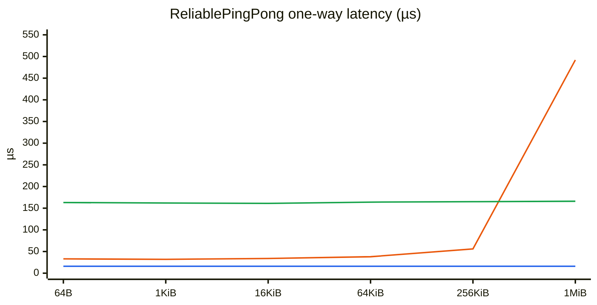
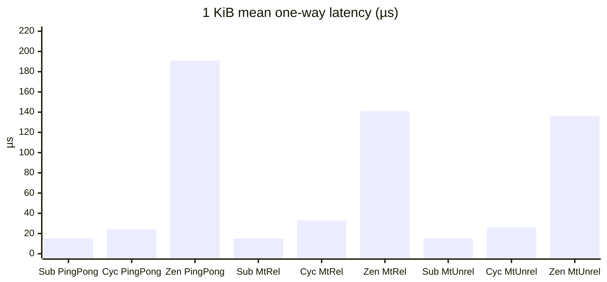

# Comparing automotive middleware

Let's talk about how GM chose a middleware for its next-generation vehicles.

The next generation is [SDV2](https://news.gm.com/home.detail.html/Pages/news/us/en/2025/oct/1022-SDV-GM-centralized-vehicle-computer-platform-electric-gas-vehicles.html) — fewer ECUs, and some seriously beefy compute nodes (think NVIDIA Thors) doing the heavy ADAS lifting. Some of the challenges that a middlware supporting an ADAS stack has to deal with are:

- It needs to wrangling huge amounts of data (from large sensor data, to model features maps getting shared).
- Theres's a lot of chatter going on, and there are many routes to deliver the messages. The middleware needs to always choose the smartest route.
- While most of that ADAS software now lives on big HPC-style boxes running Linux or QNX, the car still has a pile of smaller MCUs doing safety-critical work. Those worlds have to talk to each other and how the middleware deals with briding the worlds can be messy.

We'll walk through the use cases that actually showed up, how we turned those into requirements (and what we _didn't_ care about), and then look at three candidates — **DDS\***, **Zenoh**, and **Subspace** — side by side.

## The split personality of the vehicle

On the HPC side, life is pretty good: shared memory, big payloads, high-level OSes. We want something low-overhead that feels native there.

On the MCU side, a lot of boards run classic AUTOSAR, and even the ones that don't often still define their data exchange with ARXML. So the path of least resistance is **SOME/IP** — it's what those teams already speak.

SOME/IP is a middleware in its own right, and honestly not a great fit for most of what we want on the HPC side. So we weren't trying to rip SOME/IP out of the car. The real problem is: pick something good for the ADAS nodes, then bridge it to SOME/IP without lighting the CPU on fire when a lidar frame crosses the boundary.

## What we actually needed to do

Before writing a bunch of shall-statements, here are list of patterns that keep showing up:

1. **Everyday pub/sub between nodes** — periodic or async, nothing fancy.
2. **Safety-critical notifications** — here we usually want delivery guarantees, so RPCs are a natural fit.
3. **Mapping that pub/sub and those RPCs onto SOME/IP services** — especially for lerge sensor data, where an extra copy at the domain boundary really hurts.
4. **Diagnostics** — stuff that eventually gets marshalled toward a UDS server.
5. **Big payloads** — video, lidar. Drivers often write straight into shared memory; if the middleware copies that again, you feel it.
6. **Variable-sized messages** — without vaporizing history buffers or forcing awkward fixed ceilings.
7. **Mixed serialization** — SOME/IP, ROS, Protobuf, and our zero-copy SOME/IP library (`Zerosome`). The middleware shouldn't pick a favorite.
8. **Interporates with a good ecosystem of apps** - For data recording, snooping topics etc.

## How we turned that into requirements

We consciously made the choice of not picking a middlware and making a shoe-horn to fit our requirements around it. Its easy to ask "what does DDS offer?" and then come up with a feature lists. Instead we asked a few boring-but-useful questions, in roughly this order:

1. What _shapes_ of communication do we need? (pub/sub vs RPC, 1:1 vs 1:N)
2. What delivery guarantees do we actually care about — and what do we do when they fail?
3. Which wires exist between peers, and which one should win when more than one is available?
4. Who owns the bytes — the middleware's buffers, or driver memory we have to reuse?
5. What happens at boot when a thousand publishers show up at once? What happens if the broker dies?
6. What does tooling need to see without special-casing every app?
7. What happens when an the app crashes?

Everything else — giant QoS menus, in-middleware content filters, "must be peer-to-peer" purity — had to earn a seat. Most of it didn't.

Now, a lot of these kind of comparative studies focus on performance. I would rather not focus so much on performance, but instead focus on the design factors that influence performance. Its almost certain that a DDS Stack from RTI will perform differently from one from Cyclone, one port may be more efficient than another. However, when we understand the design philosophies we will know how performance is supposed to scale in an efficient implementation.

Of course, at the end of this document, I will be doing a token comparison on performance, but it will be clear that the zero-copy protocols perform better.

### The must-haves

**Shape.** Low-overhead middleware for talking between ADAS nodes. The bread and butter is topic pub/sub, one-to-one or one-to-many. Many-to-many? Not really our problem.

**Delivery.** Most traffic can be best-effort. Some of it has to be reliable: the message gets there, or we hear about the failure. Safety-critical request/response should be RPCs, and those RPCs should always be reliable. Streaming RPCs matter too.

**Transports.** Always take the cheapest path available:

1. Zero-copy shared memory (same ECU)
2. PCIe
3. Ethernet — SOME/IP toward MCUs, otherwise plain TCP/UDP

The SOME/IP bridge itself is a whole blog post. For this comparison we just treat "crossing that boundary without a dumb copy" as a hard requirement and move on.

**Serialization.** Stay out of the user's serialization business. Zero-copy layouts are what a lot of ADAS folks want, but other teams live in Protobuf or ROS-land, and some use `Zerosome`. If someone's already on `Zerosome`, the SOME/IP bridge shouldn't force another copy just because we felt like it.

**Copies.** Be honest about copies. Ethernet has kernel RX/TX copies — fine, that's physics. Protobuf has a different in-memory vs wire shape — that's the user's choice. What we won't accept is the middleware copying an already-serialized blob for its own bookkeeping.

**Bounded memory.** Memory use needs a ceiling. Channels get a configurable history depth. Unreliable channels drop old stuff for new stuff. Reliable channels fail the send when history is full — they don't quietly grow forever.

**Variable size.** Variable-sized messages have to play nice with that history model. Resize the channel, and the messages still sitting in history shouldn't just disappear.

**Buffer ownership.** Normal case: the middleware owns the shared-memory history buffers. Awkward case: a camera driver that already wrote into its own memory. If we can't publish from that external buffer, we copy every frame, and that's a bad day. When buffers are external, it's fair that some "middleware manages the pool" features (like certain variable-size behaviors) aren't available.

**E2E checks.** Automotive likes checksums and counters. Users should be able to opt in. Failed checksum → discard by default. On reliable channels, we can still hand the bad message to the client and let them decide.

**Python.** We need bindings. Prototyping and testing without them is painful.

**Synchronization.** Locks are where middleware gets scary. Lock-free / coroutine-style designs are much easier to reason about — and an unreleased lock while you're holding shared memory can turn into a dead zone. We've been burned enough times to care.

**Discovery.** We shouldn't overload the CPU when hundreds or thousands of publishers come online at boot. With some peer-to-peer discovery protocols, the network traffic scales with the factorial of the number of peers, so even with small discovery messages the scale of a complex system can shake the system. Dyanmic discovery is a requirement but elegant scaling is also critical.

**Broker resilience.** If the middleware has a broker (unlike classic peer-to-peer DDS), and that broker crashes, existing channels should keep working. Sure, maybe you can't create new channels or resize buffers until it's back. After a restart, old channels should still be fine and new ones should be creatable again.

**Partitions.** Different partitions / domains — yes, we need that.

**Tooling.** We want to snoop channels, peek at payloads (when the serialization is something common), list what's out there, record, and play back.

**Liveliness.** Tell us when a publisher or subscriber shows up or disappears.

### Nice to haves

- Filtering on metadata (timestamps, instance IDs) for the rare many-to-many case
- Priorities — really only matters on the network, and DSCP/PCP usually does the job better than the middleware in our opinion.
- "Give me the newest message" as a first-class thing (DDS kinda gets there with reader-side history; Subspace just has it because queues are shared)

### Stuff we explicitly don't need

A few crowd favorites didn't make the cut:

- **Deadline QoS** — the client can do this. It doesn't need to live in the middleware.
- **Durability QoS** — we don't need late joiners to see history from before they existed.
- **Lifespan QoS** — fiddly, and easy to do per-message in the serialization layer.
- **Content filtering in the middleware** — that means the middleware has to understand your serialization, which fights the whole "stay serialization-agnostic" idea. With zero-copy, filtering on the client costs about the same anyway. On the sender side, just use different topics; we don't need that to be dynamic.
- **Must be peer-to-peer** — DDS's brokerless model is nice (one less thing to crash). But discovery gets ugly fast: everyone has to find everyone else, and that traffic scales badly even when the packets are small. We'll take a brokered design if it discovers calmly and survives a broker restart.

## The shortlist

| Candidate    | Repo(s)                                                                                                                                                                                                                                               | In one sentence                                                                                |
| ------------ | ----------------------------------------------------------------------------------------------------------------------------------------------------------------------------------------------------------------------------------------------------- | ---------------------------------------------------------------------------------------------- |
| **DDS\***    | [Cyclone DDS](https://github.com/eclipse-cyclonedds/cyclonedds), [iceoryx](https://github.com/eclipse-iceoryx/iceoryx) (lab stand-in; also [Fast DDS](https://github.com/eProsima/Fast-DDS), [RTI Connext](https://www.rti.com/products/connext-dds)) | Network-first pub/sub; shared memory via iceoryx (or vendor equivalents)                       |
| **Zenoh**    | [zenoh](https://github.com/eclipse-zenoh/zenoh), [zenoh-cpp](https://github.com/eclipse-zenoh/zenoh-cpp)                                                                                                                                              | Network-first pub/sub + query; optional routers; SHM as a transport opt                        |
| **Subspace** | [subspace](https://github.com/google/subspace)                                                                                                                                                                                                        | Shared-memory-first pub/sub; TCP bridging (or custom PCIe bridging) when you leave the machine |

\* In this repo we wire up **Cyclone DDS + iceoryx** because it's open source and easy to build against. The comparison is meant to stand in for DDS more generally — you could swap in another implementation without changing the shape of the argument.

## Design center of gravity: shm-first vs network-first

This sounds fluffy until you live with it. Worth calling out before the scorecard:

- **DDS** and **Zenoh** are **network-first** designs. The core abstractions (RTPS / Zenoh sessions, discovery, congestion, routing) assume messages may cross a wire. Same-host shared memory is an _optimization bolted on_ — iceoryx under Cyclone, Zenoh’s own `zenoh-shm` path — that has to negotiate, fall back to copies, and stay coherent with the network story.
- **Subspace** is **shared-memory-first**. The happy path is POSIX shm channels on one machine; the server exists to set those up. Crossing machines is the bolt-on (TCP bridge / tunnels), not the other way around.

That matters for us because **most of our ADAS traffic is same-ECU**. Lidar frames, feature maps, camera buffers — they’re not going over Ethernet between two processes on the Thor; they’re (or should be) shared memory. A network-first stack can still do shm well, but the APIs, failure modes, buffer ownership, and “what is a channel” all grew up around packets. A shm-first stack grows up around slots, refcounts, and not touching your bytes.

When you read the truth table, keep that bias in mind: green cells for zero-copy on DDS/Zenoh often mean “yes, via an SHM sidecar.” On Subspace they mean “that _is_ the product.”

## Platform support

One thing worth getting straight before people start grading scorecards: **this middleware is for the HPC / ADAS boxes (Linux, QNX), not for the little MCUs.** MCUs already speak SOME/IP (or will, via the bridge). So "runs on a Cortex-M with 64K of RAM" is not a requirement for the candidates below — and Subspace not targeting MCUs is fine by us.

What we _do_ care about is POSIX-ish HPC targets, especially **Linux and QNX** on aarch64/x86_64.

| Platform                         | DDS\*                                                                    | Zenoh                                                                                                | Subspace                          |
| -------------------------------- | ------------------------------------------------------------------------ | ---------------------------------------------------------------------------------------------------- | --------------------------------- |
| Linux (HPC)                      | ✅                                                                       | ✅                                                                                                   | ✅                                |
| QNX (HPC)                        | ✅ (widely used in auto; vendor ports vary)                              | ⚠️ (zenoh-pico / zenoh-cpp via QNX ports / Conan recipes; full Rust stack less "batteries included") | ✅ (listed as a first-class port) |
| macOS / Android (dev)            | ⚠️ / varies                                                              | ✅-ish                                                                                               | ✅                                |
| Bare-metal / classic AUTOSAR MCU | ➖ (classic = SOME/IP; DDS Micro / Twin Oaks etc. are separate products) | ⚠️ (zenoh-pico exists; not our path)                                                                 | ➖ (not the job)                  |

So if someone says "Subspace only does POSIX, that's a gap" — for _our_ use case it isn't. The interesting platform question is really "how painful is QNX day-to-day," not "does it fit in an MCU."

## How they line up

|     | Meaning           |
| --- | ----------------- |
| ✅  | Looks good        |
| ⚠️  | Partial / caveats |
| ❌  | Weak or missing   |
| ➖  | Not applicable    |
| ❓  | Still squinting   |

This is a first pass from docs and APIs, not from our own benches.

| Requirement                                             | DDS\*                                               | Zenoh                                      | Subspace                                                                                        |
| ------------------------------------------------------- | :-------------------------------------------------- | :----------------------------------------- | :---------------------------------------------------------------------------------------------- |
| Topic pub/sub (1:1, 1:N)                                | ✅                                                  | ✅                                         | ✅                                                                                              |
| Best-effort + reliable delivery                         | ✅                                                  | ✅                                         | ✅                                                                                              |
| Reliable RPC                                            | ⚠️ need to wrap it                                  | ✅                                         | ✅                                                                                              |
| Streaming RPC                                           | ❌                                                  | ❌                                         | ✅                                                                                              |
| Zero-copy shared memory (same ECU)                      | ✅ (iceoryx **loans** only; default write copies)   | ✅ (SHM API end-to-end; normal put copies) | ✅ (shm slots _are_ the history)                                                                |
| PCIe as a first-class path                              | ❌                                                  | ❌                                         | ⚠️ (with a custom "tunnel")                                                                     |
| Ethernet (TCP/UDP)                                      | ✅                                                  | ✅                                         | ✅ (TCP)                                                                                        |
| Efficient SOME/IP domain crossing                       | ⚠️                                                  | ⚠️                                         | ✅ (because its serialization agnostic and having external buffer management)                   |
| Serialization-agnostic payloads                         | ❌                                                  | ✅                                         | ✅                                                                                              |
| Middleware doesn't copy serialized bytes                | ⚠️ (writer/reader history; loans help)              | ⚠️ (queues / routers / non-SHM path)       | ✅                                                                                              |
| Bounded history / memory ceiling                        | ✅                                                  | ✅                                         | ✅                                                                                              |
| Efficient variable-size & resize without wiping history | ⚠️ (not in the ports we tried)                      | ✅                                         | ✅                                                                                              |
| Reuse externally managed buffers                        | ⚠️ (with proprietary stacks)                        | ❌                                         | ✅                                                                                              |
| Optional checksums / E2E hooks                          | ⚠️ (with proprietary extensions)                    | ❌                                         | ✅                                                                                              |
| Python bindings                                         | ✅                                                  | ✅                                         | ✅                                                                                              |
| Lock-free / coroutine-friendly core                     | ⚠️ (maybe with a proprietary version)               | ⚠️ (Rust stack - side-steps some problems) | ✅                                                                                              |
| Discovery calm at large boot fan-out                    | ⚠️ (have to use static routing for this)            | ✅ (client→router) · ⚠️ (peer mesh)        | ✅                                                                                              |
| Existing channels survive broker death                  | ➖ (P2P)                                            | ➖ (PTP mode) · ❌ (router mode)           | ✅                                                                                              |
| Partitions / domains                                    | ✅                                                  | ✅                                         | ✅ (just use a different socket)                                                                |
| Tooling (snoop / list / record / play)                  | ✅                                                  | ⚠️                                         | ✅ (tooling not open source yet)                                                                |
| Liveliness (join/leave notifications)                   | ✅                                                  | ✅                                         | ⚠️ (there's a separate channel with network changes we subscribe to and filter for our channel) |
| Implementation / codebase size                          | ⚠️ (reasonable for ports like DDS Micro or FastDDS) | ✅                                         | ✅                                                                                              |
| Protocol complexity                                     | ⚠️                                                  | ⚠️                                         | ✅                                                                                              |
| Linux + QNX on HPC ECUs                                 | ✅                                                  | ⚠️ (QNX via ports)                         | ✅                                                                                              |

\* Same footnote as above: this column is "DDS the family." Lab bench here is Cyclone + iceoryx; another DDS stack can be dropped in.

### Digging into the interesting cells

- **RPC / streaming RPC.** Zenoh's queryables are a clean request/reply story. Subspace has actual RPC libraries on top of channels. DDS can do request/reply, but it feels bolted on, and true streaming RPC is a bit of a DIY project on all three.
- **“Zero-copy” is doing a lot of work in that table.** DDS is built around **writer history + reader history**. A normal `write()` of your buffer is not zero-copy — bytes move into the DDS path and land in the reader cache. Cyclone + iceoryx can avoid payload copies on the same host **if** you use the **loan** API (loan an iceoryx chunk, fill it, write). Docs are explicit: SHM enabled but no loan → Cyclone still **copies** into the iceoryx block. Even with loans, the reader history cache still tracks samples (often as refs to the SHM loan); any remote / non-SHM reader and you’re back to serdata/network copies. Zenoh is the same shape: a normal `put(bytes)` goes through bounded queues / transport (**copies**). Zero-copy means staying on the **SHM API** end-to-end on one host (`ZShmMut` → local subscriber maps the same segment). Hit a router, a non-SHM peer, or the “implicit pack into SHM” path and you’ve copied. Subspace is different: the shared slot _is_ the history — publisher and subscribers map the same memory; there’s no second cache you copy into for the happy path. So the green Subspace cell means “the product”; the yellow DDS/Zenoh cells mean “has a fast path if you hold it right.”
- **Serialization and copies.** Subspace is proudly "bring your own bytes." Zenoh is opaque-payload too. Classic DDS really wants IDL/CDR. Just to be clear: **any** middleware copies on a real network path — Subspace's tunnels/bridge included.
- **External buffers.** Subspace's split buffers are aimed at external allocators and driver pools. Cyclone's loan API loans _out of_ iceoryx's pool — it doesn't wrap arbitrary external memory. Zenoh SHM is provider-managed too.
- **Checksums.** Subspace has opt-in CRC (and custom callbacks). DDS and Zenoh mostly say "do E2E in the app", or with DDS, proprietary stacks do this via extensions.
- **Discovery vs liveliness.** Same topology tradeoff as broker death, just flipped: Zenoh's calm boot story is really **client→router** (clients attach to one place; they don't all scout each other). A big **peer mesh** is back in DDS-land — scouting traffic scales with who needs to find whom, and a thousand peers showing up at once is not free. DDS has real liveliness QoS, but peer discovery can get spicy at scale (static routing / discovery servers help — hence the yellow). Subspace keeps discovery simple via the server… but it doesn't really notify apps when publishers come and go the DDS/Zenoh way (there's a separate network-changes channel you filter). Zenoh liveliness tokens are first-class either way.
- **Broker death.** Zenoh isn't "P2P or nothing" — every node picks a role: **peer**, **client**, or **router**. Peer↔peer (optionally with routers in the mix) can look a lot like DDS P2P: no broker in the path, so there's nothing to kill for those links. Client→router is the brokered shape; if that router dies, those clients lose the attachment until reconnect. Subspace is different again: it _has_ a local server, but the shadow process is built so a restart can pick shared memory back up without killing existing channels. Pure DDS sidesteps the broker entirely.
- **SOME/IP.** None of these _are_ SOME/IP. Everyone needs a bridge. The open question is how cheap that bridge can be for big sensor data.
- **Complexity (two different axes).** DDS loses on both bulk and brain-damage: big implementations _and_ a fat QoS/discovery protocol surface (Micro trims the binary, not the mental model as much as you'd hope). Zenoh's **codebase** is leaner and nicer to approach than a full DDS stack — that's why implementation size goes green — but the **protocol** still has real surface area (roles, scouting, keyexprs, congestion control, SHM negotiation, advanced pub/sub). Subspace wins both: small server/client and a simple channel model.
- **Shm-first vs network-first.** Most of our load is same-ECU. Subspace’s design center is shm channels (history = slots in that shm). DDS/Zenoh are network-first with an SHM acceleration path — which is why “zero-copy” shows up as a special API, not the default.
- **Platforms.** We're picking middleware for Linux/QNX HPC nodes, not for MCUs. Subspace's POSIX/shm world (Linux, QNX, macOS, Android) matches that job. Classic AUTOSAR micros speak SOME/IP, not DDS — DDS in Adaptive AUTOSAR is still POSIX-class HW, and "DDS on an MCU" usually means a separate product (DDS Micro, Twin Oaks, …), not Cyclone-on-Thor. Zenoh can reach down via zenoh-pico and has QNX community ports, but "works on our QNX Thor image tomorrow" still wants a hands-on check.

## Benchmarks

Critical path is **publish → subscribe** one-way time: `send_ns` is stamped immediately before publish, and each timed sample ends when the subscriber takes that message (`UseManualTime`). Google Benchmark **Time** is the mean; **min_ns / median_ns / p99_ns / max_ns** counters summarize the per-message distribution.

Two shapes (size sweeps below):

1. **ReliablePingPong** — paced, one-in-flight (put → matching take → next). Sizes: 64 B → 4 MiB.
2. **MtReliableOneWay / MtUnreliableOneWay** — publisher thread + subscriber thread, credit-limited to 2 in flight. Sizes: **1 KiB → 4 MiB** (no 64 B — too small to be representative under concurrent load). Unreliable uses best-effort / DROP.

```bash
# Cyclone UDP + Cyclone+iceoryx SHM (RouDi started automatically)
bazel run //benchmarks:cyclone_bench -- --benchmark_filter=CycloneShm/Mt
bazel run //benchmarks:cyclone_bench -- --benchmark_filter=ReliablePingPong

# Zenoh SHM (two in-process sessions; no same-session loopback)
bazel run //benchmarks:zenoh_bench -- --benchmark_filter=Mt

# Subspace (in-process server)
bazel run //benchmarks:subspace_bench -- --benchmark_filter=Mt
```

Use `--config=opt` for less noisy numbers. For aggregates across repeats: `--benchmark_repetitions=5 --benchmark_report_aggregates_only`.

### Legend

|                                     | Meaning                                                                            |
| ----------------------------------- | ---------------------------------------------------------------------------------- |
| **Subspace**                        | In-process Subspace server + two clients, shm channel                              |
| **Cyclone + iceoryx / Cyclone SHM** | Cyclone DDS with shared memory via iceoryx (RouDi)                                 |
| **Zenoh (2-session SHM)**           | Two Zenoh peer sessions on loopback, `Z_LOCALITY_REMOTE`, POSIX SHM payloads       |
| **ReliablePingPong**                | Paced, one-in-flight: publish → wait for matching seq → next                       |
| **MtReliableOneWay**                | Pub + sub threads, reliable, ≤2 in flight; latency = stamp→take                    |
| **MtUnreliableOneWay**              | Same shape, best-effort / DROP; latency only over delivered samples                |
| **Mean / Time**                     | Average one-way publish→subscribe latency                                          |
| **p50 / p99**                       | Median and 99th percentile of per-message one-way samples                          |
| **queued_pct**                      | MT only: share of samples already waiting when the sub looked (drained, not timed) |
| **queued_lat_ns**                   | MT only: mean age (`now - send_ns`) of those drained queued samples                |
| **fresh_lat_ns**                    | MT only: mean latency of timed samples that required a wait                        |
| **wait_ns**                         | MT only: mean time blocked waiting for a fresh sample                              |

### Results (ReliablePingPong, same-process SHM)

Mean one-way publish→subscribe latency vs payload size. Same machine, **fastbuild** (not `--config=opt`) — treat as relative, not absolute.

| Payload | Subspace | Cyclone + iceoryx | Zenoh (2-session SHM) |
| ------: | -------: | ----------------: | --------------------: |
|    64 B |    16 µs |             33 µs |                163 µs |
|   1 KiB |    15 µs |             24 µs |                191 µs |
|  16 KiB |    16 µs |             34 µs |                161 µs |
|  64 KiB |    16 µs |             38 µs |                164 µs |
| 256 KiB |    16 µs |             56 µs |                165 µs |
|   1 MiB |    16 µs |            492 µs |                166 µs |
|   4 MiB |    17 µs |           1514 µs |                163 µs |



Chart omits 4 MiB so Cyclone’s ~1.5 ms point doesn’t flatten the other series (see table).

Notice how the `Subspace` chart is flat. This is on purpose. The hot path (publish->subscrib) only writes a 16-byte header into the slot. We skipped filling the body so multi-MiB memset wouldn’t dominate. Zenoh stays flat for the same reason; Cyclone has a serialization so it only blows up at 1–4 MiB when iceoryx/chunking actually hurts.

### Results (1 KiB, critical-path stamp → take)

Featured comparison at **1 KiB**. Mean one-way; p50 / p99 in parentheses.

| Bench              |        Subspace |     Cyclone SHM |          Zenoh SHM |
| ------------------ | --------------: | --------------: | -----------------: |
| ReliablePingPong   | 15 µs (14 / 28) | 24 µs (21 / 42) | 191 µs (193 / 243) |
| MtReliableOneWay   | 15 µs (14 / 25) | 33 µs (34 / 47) | 141 µs (139 / 174) |
| MtUnreliableOneWay | 15 µs (14 / 26) | 26 µs (26 / 40) | 136 µs (135 / 171) |



Caveats: Zenoh uses **two sessions** with `Z_LOCALITY_REMOTE`. Cyclone SHM needs RouDi/iceoryx (pools up to 8 MiB chunks). MT benches credit-limit to 2 in flight for both reliable and unreliable (unbounded unreliable flood hung drain). Fastbuild numbers — re-run with `--config=opt` before quoting externally.

## Summary / verdict

**For GM SDV2 ADAS on Thor-class HPC, Subspace is the clear pick.**

The deciding factor isn't a microbenchmark — it's design center of gravity. Most of our traffic is **same-ECU shared memory** (lidar, cameras, feature maps). Subspace is built around that: channels _are_ shm slots, serialization-agnostic, external buffers, calm server-side discovery, and channels that survive a broker restart. DDS and Zenoh are excellent **network** middlewares that can _also_ do SHM — via iceoryx loans or `zenoh-shm` — but zero-copy is a special path you have to hold carefully, not the default product shape.

Personally, I also prefer the API simplicity of `subspace` and how it resizes slots for variably sized data. For Cyclone for instance, notice how the config file hard-codes the buffer size and number of slots - making things a lot more rigid for dynamically sized types. Zenoh is similar, though the size is not hard-coded in config it is hard-coded in the C/C++/Rust code.

What the others still buy you:

- **DDS** — huge ecosystem, tooling, Adaptive AUTOSAR familiarity. Fine as a peer domain or if you already live in IDL/CDR. Wrong default for “don't touch my camera buffer.”
- **Zenoh** — nicer protocol surface than DDS, queryables, flexible topology. Still network-first; SHM is negotiated on top of a session. Strong if WAN / robot-to-everything mattered more than same-box ADAS.

What we'd still do either way: bridge to **SOME/IP** for classic AUTOSAR MCUs. Subspace doesn't need to run on the micro — it needs to cross that boundary without a dumb copy, which its buffer model is aimed at.

Token latency matches the story: Subspace ~15 µs one-way at 1 KiB (paced and MT); Cyclone+iceoryx ~24–33 µs; Zenoh two-session SHM ~140–190 µs. Design predicted the Subspace win; the benches don’t contradict it.

## What's next

1. Add some architecture diagrams for each candidate's data path (shm vs network vs bridge).
2. Discovery benchmarks
3. Big data benchmarks over SHM and Ethernet

This repo is the lab bench for that work. More soon.
