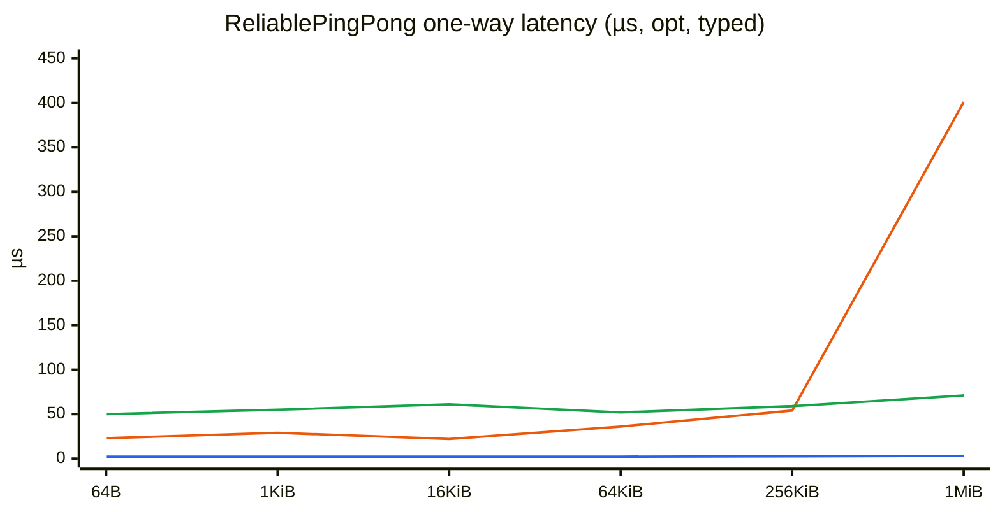
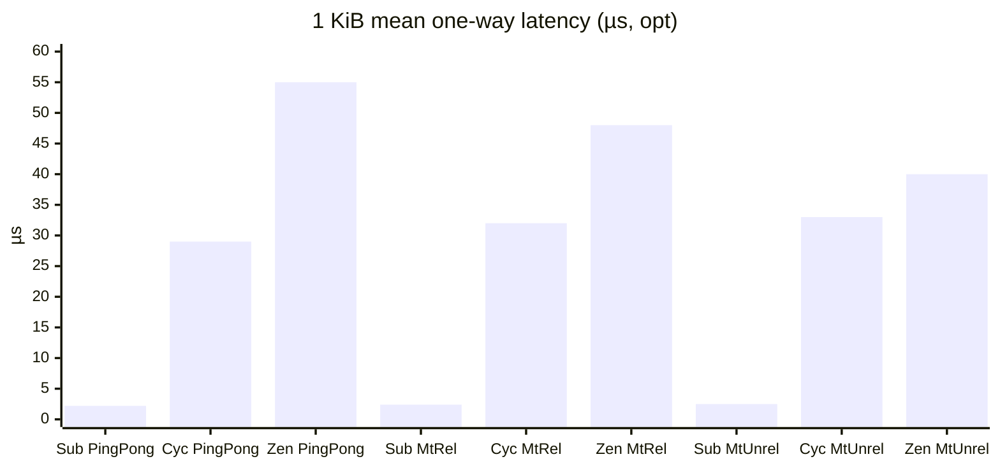
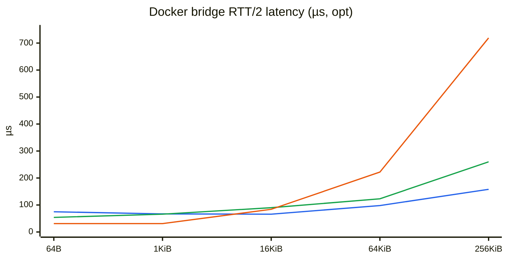

# Benchmark methodology and results

Critical path is **publish → subscribe** one-way time: `send_ns` is stamped immediately before publish, and each timed sample ends when the subscriber takes that message (`UseManualTime`). Google Benchmark **Time** is the mean; **min_ns / median_ns / p99_ns / max_ns** counters summarize the per-message distribution.

## What we run

Two shapes (size sweeps below):

1. **ReliablePingPong** — paced, one-in-flight (put → matching take → next). Sizes: 64 B → 4 MiB.
2. **MtReliableOneWay / MtUnreliableOneWay** — publisher thread + subscriber thread, credit-limited to 2 in flight. Sizes: **1 KiB → 4 MiB** (no 64 B — too small to be representative under concurrent load). Unreliable uses best-effort / DROP.

Targets:

| Binary                        | Stack                           | Same-host path                        |
| ----------------------------- | ------------------------------- | ------------------------------------- |
| `//benchmarks:cyclone_bench`  | Cyclone DDS (+ iceoryx for SHM) | SHM via iceoryx (RouDi)               |
| `//benchmarks:zenoh_bench`    | Zenoh C++                       | Two peer sessions, POSIX SHM payloads |
| `//benchmarks:subspace_bench` | Subspace                        | In-process server + shm channel       |

Network / TCP latency lives in a separate two-container harness (see [Network (Docker)](#network-docker)), not in these Google Benchmark binaries.

```bash
# Cyclone+iceoryx SHM (RouDi started automatically)
bazel run --config=opt //benchmarks:cyclone_bench -- --benchmark_filter=CycloneShm

# Zenoh SHM (two in-process sessions; no same-session loopback)
bazel run --config=opt //benchmarks:zenoh_bench -- --benchmark_filter=ZenohShm

# Subspace (in-process server)
bazel run --config=opt //benchmarks:subspace_bench -- --benchmark_filter='SubspaceFixture/'
```

Use `--config=opt` for less noisy numbers. For aggregates across repeats: `--benchmark_repetitions=5 --benchmark_report_aggregates_only`.

## Payload / schema (important)

DDS is the odd one out here, and it shows up in the curves. Zenoh and Subspace use flatbuffer which aligns with the 0-copy style that we consider ideal for large data at GM.

| Stack                | Sample layout                                                                               | Notes                                                                                                                                                                                                                          |
| -------------------- | ------------------------------------------------------------------------------------------- | ------------------------------------------------------------------------------------------------------------------------------------------------------------------------------------------------------------------------------ |
| **Cyclone**          | [`Bench.idl`](../benchmarks/Bench.idl) → idlc (`seq`, `send_ns`, `sequence<octet> data`)    | Typed CDR on the wire/SHM path. So this is not 0 copy, but it was painful to setup the 0 copy flavor.                                                                                                                          |
| **Zenoh / Subspace** | [`Bench.fbs`](../benchmarks/Bench.fbs) → `Bench::Sample` (`seq`, `send_ns`, `data:[ubyte]`) | Same logical fields as the IDL. Hot path: FlatBuffer encode → copy into SHM/slot → stamp `send_ns` → publish; sub reads `seq`/`send_ns` from the root. Data body is left uninitialized so multi-MiB `memset` doesn’t dominate. |

So the SHM latency comparison is typed-vs-typed (CDR vs FlatBuffers), not “opaque header stamp vs IDL.”

## Legend

|                                     | Meaning                                                                            |
| ----------------------------------- | ---------------------------------------------------------------------------------- |
| **Subspace**                        | In-process Subspace server + two clients, shm channel                              |
| **Cyclone + iceoryx / Cyclone SHM** | Cyclone DDS with shared memory via iceoryx (RouDi)                                 |
| **Zenoh (2-session SHM)**           | Two Zenoh peer sessions on loopback, `Z_LOCALITY_REMOTE`, POSIX SHM payloads       |
| **ReliablePingPong**                | Paced, one-in-flight: publish → wait for matching seq → next                       |
| **MtReliableOneWay**                | Pub + sub threads, reliable, ≤2 in flight; latency = stamp→take                    |
| **MtUnreliableOneWay**              | Same shape, best-effort / DROP; latency only over delivered samples                |
| **Mean / Time**                     | Average one-way publish→subscribe latency                                          |
| **p50 / p99**                       | Median and 99th percentile of per-message one-way samples                          |
| **queued_pct**                      | MT only: share of samples already waiting when the sub looked (drained, not timed) |
| **queued_lat_ns**                   | MT only: mean age (`now - send_ns`) of those drained queued samples                |
| **fresh_lat_ns**                    | MT only: mean latency of timed samples that required a wait                        |
| **wait_ns**                         | MT only: mean time blocked waiting for a fresh sample                              |

## Results (ReliablePingPong, same-process SHM)

Mean one-way publish→subscribe latency vs payload size. Same machine, **`--config=opt`**. Cyclone = IDL/CDR; Zenoh/Subspace = FlatBuffers (`Bench.fbs`).

| Payload | Subspace | Cyclone + iceoryx | Zenoh (2-session SHM) |
| ------: | -------: | ----------------: | --------------------: |
|    64 B |   2.2 µs |             23 µs |              ~50 µs\* |
|   1 KiB |   2.2 µs |             29 µs |                 55 µs |
|  16 KiB |   2.2 µs |             22 µs |                 61 µs |
|  64 KiB |   2.2 µs |             36 µs |                 52 µs |
| 256 KiB |   2.6 µs |             54 µs |                 59 µs |
|   1 MiB |   3.0 µs |            401 µs |                 71 µs |
|   4 MiB |   4.1 µs |           1612 µs |                 92 µs |

\* Zenoh 64 B is flaky in this harness (SHM demote / link); ~50 µs from a successful opt run.



Chart omits 4 MiB so Cyclone’s ~1.6 ms point doesn’t flatten the other series (see table).

FlatBuffers on Zenoh/Subspace still stays flat-ish through 4 MiB (encode + slot/SHM copy on the hot path). Cyclone’s CDR + iceoryx path is fine at small sizes and then climbs hard once payloads hit MiB scale.

## Results (1 KiB, critical-path stamp → take)

Featured comparison at **1 KiB**. Mean one-way; p50 / p99 in parentheses.

| Bench              |           Subspace |     Cyclone SHM |       Zenoh SHM |
| ------------------ | -----------------: | --------------: | --------------: |
| ReliablePingPong   | 2.2 µs (2.1 / 2.9) | 29 µs (31 / 44) | 55 µs (54 / 92) |
| MtReliableOneWay   | 2.4 µs (2.3 / 4.8) | 32 µs (32 / 48) | 48 µs (47 / 74) |
| MtUnreliableOneWay | 2.5 µs (2.5 / 3.4) | 33 µs (31 / 50) | 40 µs (43 / 67) |



Caveats: Zenoh SHM uses **two sessions** with `Z_LOCALITY_REMOTE`. Cyclone SHM needs RouDi/iceoryx (large-chunk pools bumped for MiB samples). MT benches credit-limit to 2 in flight for both reliable and unreliable. Numbers are `--config=opt` on one Linux host — relative, not a datasheet.

## Network (Docker)

Same-host Google Benchmark numbers above are **SHM only**. Cross-container network latency is a separate paced ping-pong CLI (no gbench): publisher records local `t0`/`t1` around publish→echo and reports **RTT/2** (mean / p50 / p99). No cross-container clock sync.

| Binary                          | Stack                                                         |
| ------------------------------- | ------------------------------------------------------------- |
| `//benchmarks/net:subspace_net` | Two Subspace servers, `SetLocal(false)`, TCP discovery/bridge |
| `//benchmarks/net:zenoh_net`    | Zenoh peers, SHM off, TCP connect                             |
| `//benchmarks/net:cyclone_net`  | Cyclone reliable RTPS, SHM off, Discovery `Peers`             |

```bash
# Host-build opt binaries, stage into an Ubuntu image, run pub+sub on a Docker bridge:
STACK=subspace SIZE=1024 COUNT=1000 ./docker/net/run.sh
STACK=zenoh    SIZE=1024 COUNT=1000 ./docker/net/run.sh
STACK=cyclone  SIZE=1024 COUNT=1000 ./docker/net/run.sh
```

Pub stdout is one CSV line: `stack,size,n,mean_us,p50_us,p99_us`.

Manual CLI shape (same flags across stacks):

```bash
subspace_net --role=sub --size=1024 --count=1000 --disc-port=7420
subspace_net --role=pub --peer=sub:7420 --size=1024 --count=1000 --disc-port=7421
```

### Results (RTT/2, Docker bridge)

Mean **RTT/2** vs payload size. Two containers on a user-defined bridge, **`--config=opt`**, `COUNT=500`. Measurement is local timestamps only (publish → echo).

| Payload | Subspace |  Zenoh | Cyclone |
| ------: | -------: | -----: | ------: |
|    64 B |    75 µs |  54 µs |   31 µs |
|   1 KiB |    67 µs |  66 µs |   31 µs |
|  16 KiB |    66 µs |  90 µs |   84 µs |
|  64 KiB |    98 µs | 123 µs |  222 µs |
| 256 KiB |   158 µs | 260 µs |  719 µs |
|   1 MiB |   441 µs | 713 µs | 3184 µs |

Compose sets `shm_size: 1gb` — Docker’s default 64 MB `/dev/shm` is too small for Subspace at 1 MiB × 32 slots × (req+rep) (~64 MB) and SIGBUS’d (exit 135) until that was raised.



Chart omits 1 MiB so Cyclone’s ~3.2 ms point doesn’t flatten the other series (see table). At 1 MiB: Subspace 441 µs, Zenoh 713 µs, Cyclone 3184 µs.

**1 KiB network (RTT/2):** Subspace 67 µs (62 / 125); Zenoh 66 µs (64 / 109); Cyclone 31 µs (30 / 50).

On a real Docker bridge, Subspace and Zenoh land in the same tens-of-µs class at 1 KiB — the SHM-order-of-magnitude Subspace win does **not** carry over once you’re copying onto a socket. Cyclone is competitive at small sizes here (true two-container path, no in-process short-circuit); large payloads then track bandwidth/serialize cost (FlatBuffers copy vs CDR).
