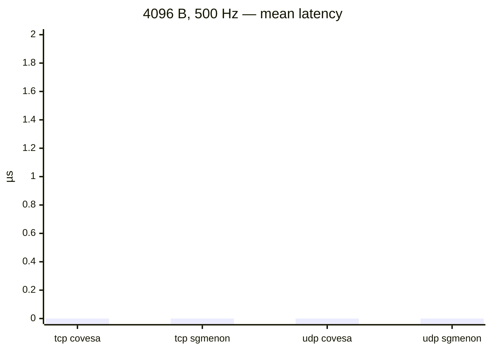

# vsomeip benchmark snapshot

Generated **2026-10-02 16:49 UTC** from `mw-benchmark` @ `0b3fec8`.

Harness: `vsomeip/docker/run.sh` (2-container bridge, pub `172.29.0.3`, sub `172.29.0.2`).
Each row: **covesa** = `routingmanagerd` + app; **sgmenon** = app-only routing host.
Samples per run: count=200, warmup=50. Latency = receive time − send stamp in payload (µs).

| stack | transport | size (B) | rate (Hz) | n | mean (µs) | p50 (µs) | p99 (µs) | gaps |
|-------|-----------|----------|-----------|---|-----------|----------|----------|------|
| covesa | tcp | 4096 | 500 | 0 | NA | NA | NA | NA |
| covesa | tcp | 4096 | 1000 | 0 | NA | NA | NA | NA |
| covesa | udp | 4096 | 500 | 0 | NA | NA | NA | NA |
| covesa | udp | 65536 | 500 | 0 | NA | NA | NA | NA |
| sgmenon | tcp | 4096 | 500 | 0 | NA | NA | NA | NA |
| sgmenon | tcp | 4096 | 1000 | 0 | NA | NA | NA | NA |
| sgmenon | udp | 4096 | 500 | 0 | NA | NA | NA | NA |
| sgmenon | udp | 65536 | 500 | 0 | NA | NA | NA | NA |

## Mean latency (µs)

One-way latency (receive − send stamp in payload). Bars omit failed runs (NA).

```mermaid
xychart-beta
    title "Mean latency by configuration"
    x-axis [
    "no data"]
    y-axis "µs" 0 --> 1
    bar [0]
```

## covesa vs sgmenon (4096 B @ 500 Hz)



Raw CSV:

```csv
stack,transport,size,rate_hz,n,mean_us,p50_us,p99_us,gap_count
covesa,tcp,4096,500,0,NA,NA,NA,NA
covesa,tcp,4096,1000,0,NA,NA,NA,NA
covesa,udp,4096,500,0,NA,NA,NA,NA
covesa,udp,65536,500,0,NA,NA,NA,NA
sgmenon,tcp,4096,500,0,NA,NA,NA,NA
sgmenon,tcp,4096,1000,0,NA,NA,NA,NA
sgmenon,udp,4096,500,0,NA,NA,NA,NA
sgmenon,udp,65536,500,0,NA,NA,NA,NA
```
