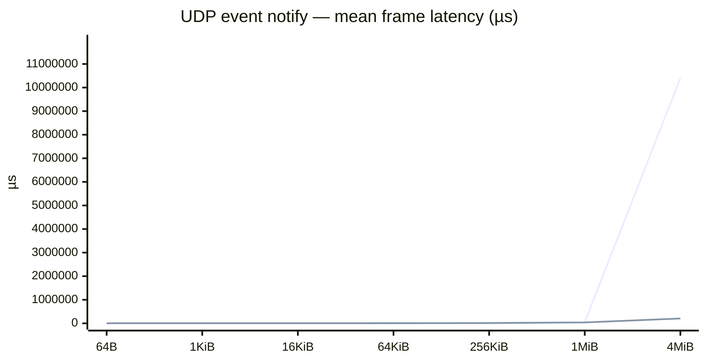

# vsomeip benchmark snapshot

Generated **2026-10-02 19:55 UTC** from `mw-benchmark` @ `90d96f8`.

Harness: `vsomeip/docker/run.sh` (2-container bridge, pub `172.29.0.3`, sub `172.29.0.2`).
Each row: **covesa** = `routingmanagerd` + app; **sgmenon** = app-only routing host.

**Metric:** one-way latency for a **full frame** — one reassembled event payload (`size` bytes), stamped before send and timed after reassembly (µs). Each run records a **distribution** over `count`=200 samples (warmup=50). Publish **rate (Hz)** is a fixed pace so frames do not pile up; it is not swept (use a different harness if you care about CPU vs rate).

| stack   | frame (B) | rate (Hz) | n   | mean (µs)    | p50 (µs)     | p99 (µs)     | gaps |
| ------- | --------- | --------- | --- | ------------ | ------------ | ------------ | ---- |
| covesa  | 64        | 100.0     | 200 | 5765.993     | 5747.416     | 6042.220     | 0    |
| sgmenon | 64        | 100.0     | 200 | 5214.468     | 5199.965     | 5362.839     | 0    |
| covesa  | 1024      | 100.0     | 200 | 5530.997     | 5517.870     | 5812.220     | 0    |
| sgmenon | 1024      | 100.0     | 200 | 5210.828     | 5195.650     | 5365.250     | 0    |
| covesa  | 16384     | 100.0     | 200 | 5928.795     | 5905.340     | 6416.390     | 0    |
| sgmenon | 16384     | 100.0     | 200 | 5646.122     | 5609.170     | 5950.508     | 0    |
| covesa  | 65536     | 50.0      | 200 | 7313.089     | 7203.050     | 8030.370     | 0    |
| sgmenon | 65536     | 50.0      | 200 | 7275.640     | 7274.255     | 8001.851     | 0    |
| covesa  | 262144    | 50.0      | 200 | 13686.519    | 13028.489    | 18844.209    | 0    |
| sgmenon | 262144    | 50.0      | 200 | 12594.125    | 12211.495    | 14710.708    | 0    |
| covesa  | 1048576   | 10.0      | 200 | 49624.208    | 49313.384    | 62293.264    | 0    |
| sgmenon | 1048576   | 10.0      | 200 | 40283.676    | 40597.500    | 46483.806    | 0    |
| covesa  | 4194304   | 10.0      | 100 | 10405036.837 | 10396447.727 | 15543217.154 | 0    |
| sgmenon | 4194304   | 10.0      | 199 | 205757.025   | 194184.676   | 303405.352   | 0    |

## Frame latency vs payload size (mean of samples)

Same size ladder as [ReliablePingPong SHM](../../notes/benchmarks.md#results-reliablepingpong-same-process-shm) (64 B … 4 MiB). Lines use **mean**; see table for p50/p99.



Raw CSV:

```csv
stack,size,rate_hz,n,mean_us,p50_us,p99_us,gap_count
covesa,64,100.0,200,5765.993,5747.416,6042.220,0
sgmenon,64,100.0,200,5214.468,5199.965,5362.839,0
covesa,1024,100.0,200,5530.997,5517.870,5812.220,0
sgmenon,1024,100.0,200,5210.828,5195.650,5365.250,0
covesa,16384,100.0,200,5928.795,5905.340,6416.390,0
sgmenon,16384,100.0,200,5646.122,5609.170,5950.508,0
covesa,65536,50.0,200,7313.089,7203.050,8030.370,0
sgmenon,65536,50.0,200,7275.640,7274.255,8001.851,0
covesa,262144,50.0,200,13686.519,13028.489,18844.209,0
sgmenon,262144,50.0,200,12594.125,12211.495,14710.708,0
covesa,1048576,10.0,200,49624.208,49313.384,62293.264,0
sgmenon,1048576,10.0,200,40283.676,40597.500,46483.806,0
covesa,4194304,10.0,100,10405036.837,10396447.727,15543217.154,0
sgmenon,4194304,10.0,199,205757.025,194184.676,303405.352,0

```
