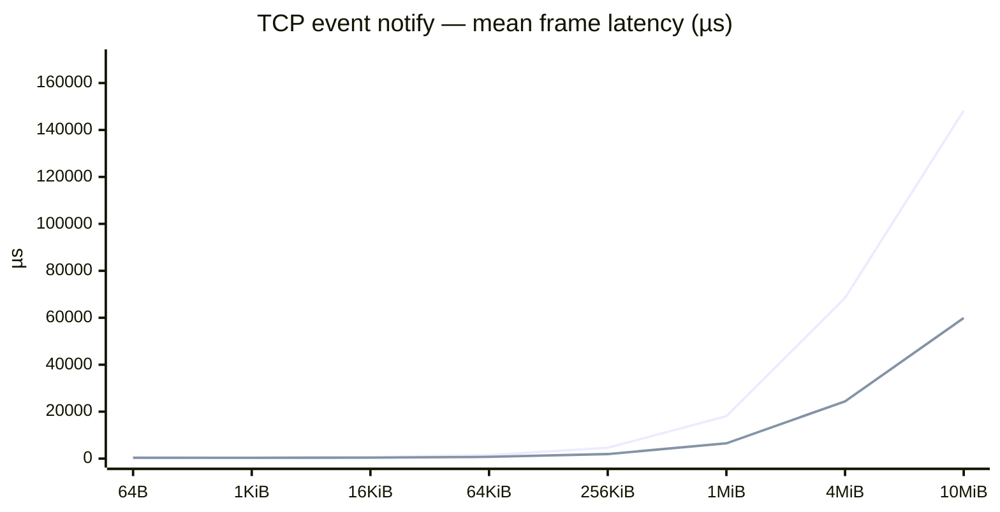
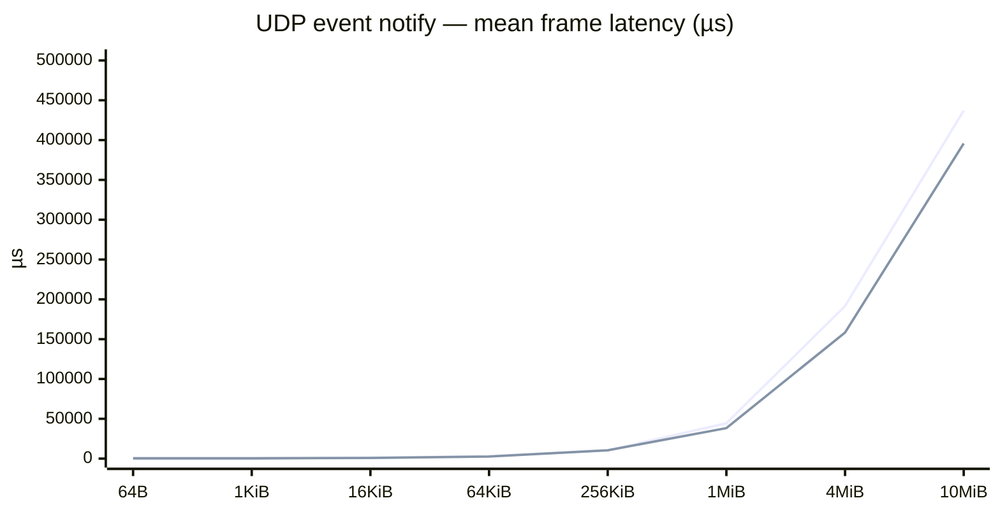

# vsomeip benchmark snapshot

Generated **2026-10-05 19:48 UTC** from `mw-benchmark` @ `f12b933`.

Harness: `vsomeip/docker/run.sh` (2-container bridge, pub `172.29.0.3`, sub `172.29.0.2`).
Each row: **covesa** = `routingmanagerd` + app; **sgmenon** = app-only routing host.

**Metric:** one-way latency for a **full frame** (`size` bytes), from immediately before the first `notify` until the complete frame reaches the subscriber (µs). UDP uses multiple user-space chunks; TCP uses one event notification. The UDP subscriber tracks chunk order but does not reassemble or copy frame data. Each run records a distribution after 50 warmup frames. Publish **rate (Hz)** is a fixed pace so frames do not pile up; it is not swept.

## TCP

Data source **`/home/siddharth.menon/repos/mw-benchmark/bench_results/vsomeip/snapshot-tcp.csv`**. This section: run **`snapshot-20261005T175359Z`**.

| frame              | rate (Hz) | n   | latency statistic        | 3.6.1 latency | sgmenon latency |
| ------------------ | --------- | --- | ------------------------ | ------------- | --------------- |
| 64B (64 B)         | 100.0     | 200 | mean (µs)                | 601.600       | 348.722         |
|                    |           |     | p99 (µs)                 | 873.247       | 501.270         |
|                    |           |     | sgmenon mean improvement | —             | 42.0%           |
| 1KiB (1024 B)      | 100.0     | 200 | mean (µs)                | 394.768       | 341.009         |
|                    |           |     | p99 (µs)                 | 693.700       | 518.909         |
|                    |           |     | sgmenon mean improvement | —             | 13.6%           |
| 16KiB (16384 B)    | 100.0     | 200 | mean (µs)                | 635.284       | 420.943         |
|                    |           |     | p99 (µs)                 | 890.368       | 569.686         |
|                    |           |     | sgmenon mean improvement | —             | 33.7%           |
| 64KiB (65536 B)    | 50.0      | 200 | mean (µs)                | 1526.010      | 737.400         |
|                    |           |     | p99 (µs)                 | 1783.487      | 931.706         |
|                    |           |     | sgmenon mean improvement | —             | 51.7%           |
| 256KiB (262144 B)  | 50.0      | 200 | mean (µs)                | 4598.980      | 1935.802        |
|                    |           |     | p99 (µs)                 | 5543.199      | 2274.090        |
|                    |           |     | sgmenon mean improvement | —             | 57.9%           |
| 1MiB (1048576 B)   | 10.0      | 200 | mean (µs)                | 18043.282     | 6503.969        |
|                    |           |     | p99 (µs)                 | 21830.439     | 7071.725        |
|                    |           |     | sgmenon mean improvement | —             | 64.0%           |
| 4MiB (4194304 B)   | 2.0       | 100 | mean (µs)                | 68460.335     | 24404.524       |
|                    |           |     | p99 (µs)                 | 88586.276     | 26733.626       |
|                    |           |     | sgmenon mean improvement | —             | 64.4%           |
| 10MiB (10485760 B) | 1.0       | 50  | mean (µs)                | 148230.048    | 59891.663       |
|                    |           |     | p99 (µs)                 | 181042.781    | 64947.899       |
|                    |           |     | sgmenon mean improvement | —             | 59.6%           |

### Frame latency vs payload size (mean of samples) over `TCP`

Same size ladder as [ReliablePingPong SHM](../../notes/benchmarks.md#results-reliablepingpong-same-process-shm) (64 B … 10 MiB). Lines use **mean**; see table for p50/p99.



Raw TCP CSV:

```csv
recorded_utc,git_sha,run_label,count,warmup,stack,size,rate_hz,n,mean_us,p50_us,p99_us,gap_count
2026-10-05 17:53 UTC,1bbfdad,snapshot-20261005T175359Z,200,50,covesa,64,100.0,200,601.600,596.885,873.247,0
2026-10-05 17:53 UTC,1bbfdad,snapshot-20261005T175359Z,200,50,sgmenon,64,100.0,200,348.722,340.125,501.270,0
2026-10-05 17:53 UTC,1bbfdad,snapshot-20261005T175359Z,200,50,covesa,1024,100.0,200,394.768,364.379,693.700,0
2026-10-05 17:53 UTC,1bbfdad,snapshot-20261005T175359Z,200,50,sgmenon,1024,100.0,200,341.009,337.485,518.909,0
2026-10-05 17:53 UTC,1bbfdad,snapshot-20261005T175359Z,200,50,covesa,16384,100.0,200,635.284,621.455,890.368,0
2026-10-05 17:53 UTC,1bbfdad,snapshot-20261005T175359Z,200,50,sgmenon,16384,100.0,200,420.943,419.950,569.686,0
2026-10-05 17:53 UTC,1bbfdad,snapshot-20261005T175359Z,200,50,covesa,65536,50.0,200,1526.010,1513.964,1783.487,0
2026-10-05 17:53 UTC,1bbfdad,snapshot-20261005T175359Z,200,50,sgmenon,65536,50.0,200,737.400,724.355,931.706,0
2026-10-05 17:53 UTC,1bbfdad,snapshot-20261005T175359Z,200,50,covesa,262144,50.0,200,4598.980,4585.548,5543.199,0
2026-10-05 17:53 UTC,1bbfdad,snapshot-20261005T175359Z,200,50,sgmenon,262144,50.0,200,1935.802,1925.684,2274.090,0
2026-10-05 17:53 UTC,1bbfdad,snapshot-20261005T175359Z,200,50,covesa,1048576,10.0,200,18043.282,17868.650,21830.439,0
2026-10-05 17:53 UTC,1bbfdad,snapshot-20261005T175359Z,200,50,sgmenon,1048576,10.0,200,6503.969,6470.286,7071.725,0
2026-10-05 17:53 UTC,1bbfdad,snapshot-20261005T175359Z,100,50,covesa,4194304,2.0,100,68460.335,68054.637,88586.276,0
2026-10-05 17:53 UTC,1bbfdad,snapshot-20261005T175359Z,100,50,sgmenon,4194304,2.0,100,24404.524,24050.466,26733.626,0
2026-10-05 17:53 UTC,1bbfdad,snapshot-20261005T175359Z,50,50,covesa,10485760,1.0,50,148230.048,147925.044,181042.781,0
2026-10-05 17:53 UTC,1bbfdad,snapshot-20261005T175359Z,50,50,sgmenon,10485760,1.0,50,59891.663,58986.452,64947.899,0

```

## UDP

Data source **`/home/siddharth.menon/repos/mw-benchmark/bench_results/vsomeip/snapshot.csv`**. This section: run **`snapshot-20261005T173031Z`**.

| frame              | rate (Hz) | n   | latency statistic        | 3.6.1 latency | sgmenon latency |
| ------------------ | --------- | --- | ------------------------ | ------------- | --------------- |
| 64B (64 B)         | 100.0     | 200 | mean (µs)                | 682.276       | 311.506         |
|                    |           |     | p99 (µs)                 | 1013.806      | 479.195         |
|                    |           |     | sgmenon mean improvement | —             | 54.3%           |
| 1KiB (1024 B)      | 100.0     | 200 | mean (µs)                | 660.818       | 321.463         |
|                    |           |     | p99 (µs)                 | 853.353       | 497.857         |
|                    |           |     | sgmenon mean improvement | —             | 51.4%           |
| 16KiB (16384 B)    | 100.0     | 200 | mean (µs)                | 1192.701      | 843.788         |
|                    |           |     | p99 (µs)                 | 1676.718      | 1274.024        |
|                    |           |     | sgmenon mean improvement | —             | 29.3%           |
| 64KiB (65536 B)    | 50.0      | 200 | mean (µs)                | 2973.088      | 2662.239        |
|                    |           |     | p99 (µs)                 | 3686.316      | 3461.423        |
|                    |           |     | sgmenon mean improvement | —             | 10.5%           |
| 256KiB (262144 B)  | 50.0      | 200 | mean (µs)                | 10510.292     | 10461.543       |
|                    |           |     | p99 (µs)                 | 13651.278     | 13187.380       |
|                    |           |     | sgmenon mean improvement | —             | 0.5%            |
| 1MiB (1048576 B)   | 10.0      | 200 | mean (µs)                | 44340.226     | 38271.420       |
|                    |           |     | p99 (µs)                 | 56151.502     | 46869.797       |
|                    |           |     | sgmenon mean improvement | —             | 13.7%           |
| 4MiB (4194304 B)   | 2.0       | 100 | mean (µs)                | 191582.154    | 158301.779      |
|                    |           |     | p99 (µs)                 | 227914.249    | 188509.188      |
|                    |           |     | sgmenon mean improvement | —             | 17.4%           |
| 10MiB (10485760 B) | 1.0       | 50  | mean (µs)                | 436967.927    | 395841.048      |
|                    |           |     | p99 (µs)                 | 490963.294    | 453322.815      |
|                    |           |     | sgmenon mean improvement | —             | 9.4%            |

### Frame latency vs payload size (mean of samples) over `UDP`

Same size ladder as [ReliablePingPong SHM](../../notes/benchmarks.md#results-reliablepingpong-same-process-shm) (64 B … 10 MiB). Lines use **mean**; see table for p50/p99.



Raw UDP CSV:

```csv
recorded_utc,git_sha,run_label,count,warmup,stack,size,rate_hz,n,mean_us,p50_us,p99_us,gap_count
2026-10-05 17:30 UTC,1bbfdad,snapshot-20261005T173031Z,200,50,covesa,64,100.0,200,682.276,664.514,1013.806,0
2026-10-05 17:30 UTC,1bbfdad,snapshot-20261005T173031Z,200,50,sgmenon,64,100.0,200,311.506,310.320,479.195,0
2026-10-05 17:30 UTC,1bbfdad,snapshot-20261005T173031Z,200,50,covesa,1024,100.0,200,660.818,659.995,853.353,0
2026-10-05 17:30 UTC,1bbfdad,snapshot-20261005T173031Z,200,50,sgmenon,1024,100.0,200,321.463,315.860,497.857,0
2026-10-05 17:30 UTC,1bbfdad,snapshot-20261005T173031Z,200,50,covesa,16384,100.0,200,1192.701,1179.344,1676.718,0
2026-10-05 17:30 UTC,1bbfdad,snapshot-20261005T173031Z,200,50,sgmenon,16384,100.0,200,843.788,835.654,1274.024,0
2026-10-05 17:30 UTC,1bbfdad,snapshot-20261005T173031Z,200,50,covesa,65536,50.0,200,2973.088,2863.864,3686.316,0
2026-10-05 17:30 UTC,1bbfdad,snapshot-20261005T173031Z,200,50,sgmenon,65536,50.0,200,2662.239,2585.034,3461.423,0
2026-10-05 17:30 UTC,1bbfdad,snapshot-20261005T173031Z,200,50,covesa,262144,50.0,200,10510.292,9987.259,13651.278,0
2026-10-05 17:30 UTC,1bbfdad,snapshot-20261005T173031Z,200,50,sgmenon,262144,50.0,200,10461.543,10302.370,13187.380,0
2026-10-05 17:30 UTC,1bbfdad,snapshot-20261005T173031Z,200,50,covesa,1048576,10.0,200,44340.226,43657.241,56151.502,0
2026-10-05 17:30 UTC,1bbfdad,snapshot-20261005T173031Z,200,50,sgmenon,1048576,10.0,200,38271.420,37180.149,46869.797,0
2026-10-05 17:30 UTC,1bbfdad,snapshot-20261005T173031Z,100,50,covesa,4194304,2.0,100,191582.154,192609.763,227914.249,0
2026-10-05 17:30 UTC,1bbfdad,snapshot-20261005T173031Z,100,50,sgmenon,4194304,2.0,100,158301.779,155977.223,188509.188,0
2026-10-05 17:30 UTC,1bbfdad,snapshot-20261005T173031Z,50,50,covesa,10485760,1.0,50,436967.927,445343.262,490963.294,0
2026-10-05 17:30 UTC,1bbfdad,snapshot-20261005T173031Z,50,50,sgmenon,10485760,1.0,50,395841.048,395336.284,453322.815,0

```
