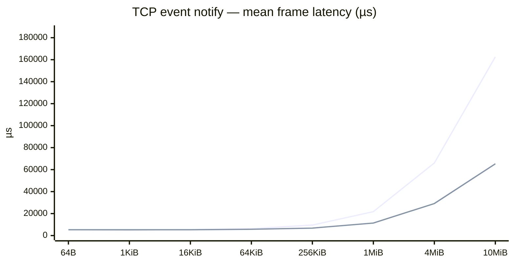
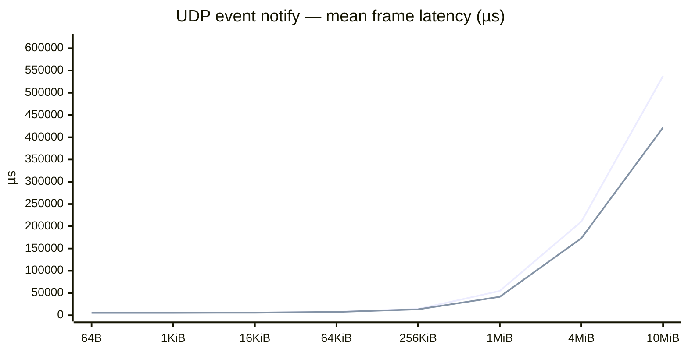

# vsomeip benchmark snapshot

Generated **2026-10-05 14:57 UTC** from `mw-benchmark` @ `e925894`.

Harness: `vsomeip/docker/run.sh` (2-container bridge, pub `172.29.0.3`, sub `172.29.0.2`).
Each row: **covesa** = `routingmanagerd` + app; **sgmenon** = app-only routing host.

**Metric:** one-way latency for a **full frame** (`size` bytes), from immediately before the first `notify` until the complete frame reaches the subscriber (µs). UDP uses multiple user-space chunks; TCP uses one event notification. The UDP subscriber tracks chunk order but does not reassemble or copy frame data. Each run records a distribution after 50 warmup frames. Publish **rate (Hz)** is a fixed pace so frames do not pile up; it is not swept.

## TCP

Data source **`/home/siddharth.menon/repos/mw-benchmark/bench_results/vsomeip/snapshot-tcp.csv`**. This section: run **`snapshot-20261005T143431Z`**.

| frame              | rate (Hz) | n   | latency statistic        | 3.6.1 latency | sgmenon latency |
| ------------------ | --------- | --- | ------------------------ | ------------- | --------------- |
| 64B (64 B)         | 100.0     | 200 | mean (µs)                | 5448.863      | 5275.561        |
|                    |           |     | p99 (µs)                 | 5719.254      | 5431.893        |
|                    |           |     | sgmenon mean improvement | —             | 3.2%            |
| 1KiB (1024 B)      | 100.0     | 200 | mean (µs)                | 5350.230      | 5246.185        |
|                    |           |     | p99 (µs)                 | 5484.068      | 5434.682        |
|                    |           |     | sgmenon mean improvement | —             | 1.9%            |
| 16KiB (16384 B)    | 100.0     | 200 | mean (µs)                | 5475.734      | 5307.916        |
|                    |           |     | p99 (µs)                 | 5652.264      | 5470.118        |
|                    |           |     | sgmenon mean improvement | —             | 3.1%            |
| 64KiB (65536 B)    | 50.0      | 200 | mean (µs)                | 6258.129      | 5718.326        |
|                    |           |     | p99 (µs)                 | 6587.934      | 5951.857        |
|                    |           |     | sgmenon mean improvement | —             | 8.6%            |
| 256KiB (262144 B)  | 50.0      | 200 | mean (µs)                | 9566.528      | 6808.014        |
|                    |           |     | p99 (µs)                 | 10627.947     | 7085.768        |
|                    |           |     | sgmenon mean improvement | —             | 28.8%           |
| 1MiB (1048576 B)   | 10.0      | 200 | mean (µs)                | 21746.400     | 11391.537       |
|                    |           |     | p99 (µs)                 | 24753.623     | 11958.442       |
|                    |           |     | sgmenon mean improvement | —             | 47.6%           |
| 4MiB (4194304 B)   | 2.0       | 100 | mean (µs)                | 66041.190     | 29148.500       |
|                    |           |     | p99 (µs)                 | 75089.019     | 31036.100       |
|                    |           |     | sgmenon mean improvement | —             | 55.9%           |
| 10MiB (10485760 B) | 1.0       | 50  | mean (µs)                | 162590.122    | 65306.368       |
|                    |           |     | p99 (µs)                 | 195426.866    | 69910.404       |
|                    |           |     | sgmenon mean improvement | —             | 59.8%           |

### Frame latency vs payload size (mean of samples)

Same size ladder as [ReliablePingPong SHM](../../notes/benchmarks.md#results-reliablepingpong-same-process-shm) (64 B … 10 MiB). Lines use **mean**; see table for p50/p99.



Raw TCP CSV:

```csv
recorded_utc,git_sha,run_label,count,warmup,stack,size,rate_hz,n,mean_us,p50_us,p99_us,gap_count
2026-10-05 14:34 UTC,e925894,snapshot-20261005T143431Z,200,50,covesa,64,100.0,200,5448.863,5435.337,5719.254,0
2026-10-05 14:34 UTC,e925894,snapshot-20261005T143431Z,200,50,sgmenon,64,100.0,200,5275.561,5256.762,5431.893,0
2026-10-05 14:34 UTC,e925894,snapshot-20261005T143431Z,200,50,covesa,1024,100.0,200,5350.230,5339.967,5484.068,0
2026-10-05 14:34 UTC,e925894,snapshot-20261005T143431Z,200,50,sgmenon,1024,100.0,200,5246.185,5237.887,5434.682,0
2026-10-05 14:34 UTC,e925894,snapshot-20261005T143431Z,200,50,covesa,16384,100.0,200,5475.734,5464.927,5652.264,0
2026-10-05 14:34 UTC,e925894,snapshot-20261005T143431Z,200,50,sgmenon,16384,100.0,200,5307.916,5302.527,5470.118,0
2026-10-05 14:34 UTC,e925894,snapshot-20261005T143431Z,200,50,covesa,65536,50.0,200,6258.129,6253.937,6587.934,0
2026-10-05 14:34 UTC,e925894,snapshot-20261005T143431Z,200,50,sgmenon,65536,50.0,200,5718.326,5700.683,5951.857,0
2026-10-05 14:34 UTC,e925894,snapshot-20261005T143431Z,200,50,covesa,262144,50.0,200,9566.528,9538.885,10627.947,0
2026-10-05 14:34 UTC,e925894,snapshot-20261005T143431Z,200,50,sgmenon,262144,50.0,200,6808.014,6810.717,7085.768,0
2026-10-05 14:34 UTC,e925894,snapshot-20261005T143431Z,200,50,covesa,1048576,10.0,200,21746.400,21764.833,24753.623,0
2026-10-05 14:34 UTC,e925894,snapshot-20261005T143431Z,200,50,sgmenon,1048576,10.0,200,11391.537,11334.509,11958.442,0
2026-10-05 14:34 UTC,e925894,snapshot-20261005T143431Z,100,50,covesa,4194304,2.0,100,66041.190,65691.954,75089.019,0
2026-10-05 14:34 UTC,e925894,snapshot-20261005T143431Z,100,50,sgmenon,4194304,2.0,100,29148.500,28752.989,31036.100,0
2026-10-05 14:34 UTC,e925894,snapshot-20261005T143431Z,50,50,covesa,10485760,1.0,50,162590.122,162961.380,195426.866,0
2026-10-05 14:34 UTC,e925894,snapshot-20261005T143431Z,50,50,sgmenon,10485760,1.0,50,65306.368,63868.465,69910.404,0

```

## UDP

Data source **`/home/siddharth.menon/repos/mw-benchmark/bench_results/vsomeip/snapshot.csv`**. This section: run **`snapshot-20261005T041850Z`**.

| frame              | rate (Hz) | n   | latency statistic        | 3.6.1 latency | sgmenon latency |
| ------------------ | --------- | --- | ------------------------ | ------------- | --------------- |
| 64B (64 B)         | 100.0     | 200 | mean (µs)                | 5679.635      | 5357.976        |
|                    |           |     | p99 (µs)                 | 6039.783      | 5562.310        |
|                    |           |     | sgmenon mean improvement | —             | 5.7%            |
| 1KiB (1024 B)      | 100.0     | 200 | mean (µs)                | 5626.144      | 5556.802        |
|                    |           |     | p99 (µs)                 | 5889.396      | 7434.412        |
|                    |           |     | sgmenon mean improvement | —             | 1.2%            |
| 16KiB (16384 B)    | 100.0     | 200 | mean (µs)                | 5995.980      | 5808.618        |
|                    |           |     | p99 (µs)                 | 6370.512      | 6204.763        |
|                    |           |     | sgmenon mean improvement | —             | 3.1%            |
| 64KiB (65536 B)    | 50.0      | 200 | mean (µs)                | 7553.618      | 7438.304        |
|                    |           |     | p99 (µs)                 | 8487.770      | 8207.333        |
|                    |           |     | sgmenon mean improvement | —             | 1.5%            |
| 256KiB (262144 B)  | 50.0      | 200 | mean (µs)                | 13955.920     | 13346.705       |
|                    |           |     | p99 (µs)                 | 18835.748     | 16311.188       |
|                    |           |     | sgmenon mean improvement | —             | 4.4%            |
| 1MiB (1048576 B)   | 10.0      | 200 | mean (µs)                | 54705.413     | 41592.758       |
|                    |           |     | p99 (µs)                 | 71053.559     | 49518.394       |
|                    |           |     | sgmenon mean improvement | —             | 24.0%           |
| 4MiB (4194304 B)   | 2.0       | 100 | mean (µs)                | 210659.519    | 173191.648      |
|                    |           |     | p99 (µs)                 | 254120.379    | 191788.374      |
|                    |           |     | sgmenon mean improvement | —             | 17.8%           |
| 10MiB (10485760 B) | 1.0       | 50  | mean (µs)                | 537525.674    | 421893.922      |
|                    |           |     | p99 (µs)                 | 580955.924    | 463009.349      |
|                    |           |     | sgmenon mean improvement | —             | 21.5%           |

### Frame latency vs payload size (mean of samples)

Same size ladder as [ReliablePingPong SHM](../../notes/benchmarks.md#results-reliablepingpong-same-process-shm) (64 B … 10 MiB). Lines use **mean**; see table for p50/p99.



Raw UDP CSV:

```csv
recorded_utc,git_sha,run_label,count,warmup,stack,size,rate_hz,n,mean_us,p50_us,p99_us,gap_count
2026-10-05 04:18 UTC,6c1e716,snapshot-20261005T041850Z,200,50,covesa,64,100.0,200,5679.635,5668.960,6039.783,0
2026-10-05 04:18 UTC,6c1e716,snapshot-20261005T041850Z,200,50,sgmenon,64,100.0,200,5357.976,5356.739,5562.310,0
2026-10-05 04:18 UTC,6c1e716,snapshot-20261005T041850Z,200,50,covesa,1024,100.0,200,5626.144,5627.090,5889.396,0
2026-10-05 04:18 UTC,6c1e716,snapshot-20261005T041850Z,200,50,sgmenon,1024,100.0,200,5556.802,5503.420,7434.412,0
2026-10-05 04:18 UTC,6c1e716,snapshot-20261005T041850Z,200,50,covesa,16384,100.0,200,5995.980,5988.100,6370.512,0
2026-10-05 04:18 UTC,6c1e716,snapshot-20261005T041850Z,200,50,sgmenon,16384,100.0,200,5808.618,5794.685,6204.763,0
2026-10-05 04:18 UTC,6c1e716,snapshot-20261005T041850Z,200,50,covesa,65536,50.0,200,7553.618,7529.205,8487.770,0
2026-10-05 04:18 UTC,6c1e716,snapshot-20261005T041850Z,200,50,sgmenon,65536,50.0,200,7438.304,7429.354,8207.333,0
2026-10-05 04:18 UTC,6c1e716,snapshot-20261005T041850Z,200,50,covesa,262144,50.0,200,13955.920,13254.495,18835.748,0
2026-10-05 04:18 UTC,6c1e716,snapshot-20261005T041850Z,200,50,sgmenon,262144,50.0,200,13346.705,13538.465,16311.188,0
2026-10-05 04:18 UTC,6c1e716,snapshot-20261005T041850Z,200,50,covesa,1048576,10.0,200,54705.413,54301.369,71053.559,0
2026-10-05 04:18 UTC,6c1e716,snapshot-20261005T041850Z,200,50,sgmenon,1048576,10.0,200,41592.758,42271.700,49518.394,0
2026-10-05 04:18 UTC,6c1e716,snapshot-20261005T041850Z,100,50,covesa,4194304,2.0,100,210659.519,211549.327,254120.379,0
2026-10-05 04:18 UTC,6c1e716,snapshot-20261005T041850Z,100,50,sgmenon,4194304,2.0,100,173191.648,174911.263,191788.374,0
2026-10-05 04:18 UTC,6c1e716,snapshot-20261005T041850Z,50,50,covesa,10485760,1.0,50,537525.674,541148.618,580955.924,0
2026-10-05 04:18 UTC,6c1e716,snapshot-20261005T041850Z,50,50,sgmenon,10485760,1.0,50,421893.922,425593.165,463009.349,0

```
